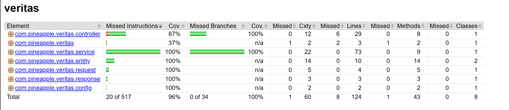

<h1 align="center">Veritas: A lightweight Generative AI detection service</h1>

Collaborators: Nick Ching (nc2935), Naren Loganathan (nl2878), Suwei Ma (sm5011), Avery Fan (mf3332)
  
Contributions + Tasks: [Trello Board](https://trello.com/invite/b/6702d91258eab0e42ba8174c/ATTId2e43923e75399a4283c25456224c3a27CF0F058/pineapple-veritas)

## **About The Project**

Veritas is a lightweight and flexible service that abstracts the task of detecting AI-generated text in various contexts. Utilizing the cutting edge paper: [Raidar: geneRative AI Detection viA Rewriting](https://arxiv.org/pdf/2401.12970) published by Mao, Vondrick, Wang, and Yang. 

## **Current Progress**
  - **27 Nov 2024:** Added login functionality and finalized endpoints for Vertias Service! 
  - **18 Oct 2024:** Completed development of Vertias service (including Java API controller, DB handlers and Python Microservice)

---

## **Vertias Architecture**

Veritas's Service utilizes a modular microservice design:
- Java Springboot API Handler: controls all business service logic, handling interactions with the ML model and our persistent storage
- Python ML microservice: this microservice is solely responsible for detecting AI-generated text. It is deployed on a separate GCP VM so and interacted with through HTTP
- Cloud SQL on GCP: The final component of our service is persistent storage, hosted on GCP. 

## **Project Requirements** 
1. Java Development Kit (JDK): Version 17 or later
   - Ensure that javac and java are installed and properly configured in your system's PATH.
   - you can verify this by running `javac --version` and `java-version`

2. Maven: Used for building the project
   - Maven should be installed and accessible via the CLI
   - you can verify this by running `mvn --version`
  
4. Python 3.11 or later: For deploying the Veritas microservice:
   - You can check your version using `python3 --version`
  
5. Intellij: Note that this project was built using Intellij IDEA, but it should work with any Java-compatible IDE. 

## **How to build our project**
 - Clone the GitHub repo, open the `veritas` directory in IntelliJ, run the default generated run configuration for `VeritasApplication` from the IDE.
 - Tests can be run (`mvn test`) without the extra DB/flask server setup (since we mock). Check `application.yaml` for the additional env vars required otherwise.
 - Set up a MySQL database (we use Cloud SQL), set the `DB_URL`, `DB_USERNAME` and `DB_PASSWORD` environment variables accordingly.
 - **ML Microservice:** Create a python3 venv (we did this on a separate GCP VM) `python3 -m venv <env-name>`, run `pip install -r requirements.txt` from the `check-gpt` directory and start up the flask server by running `python3 app.py`.
 - Get the URL for the server and set the `MODEL_MICROSERVICE_URL` env var accordingly.

## **Interacting with our service**
 - Endpoint information is described in the next section. We use Postman to craft our requests and point it at the URL we obtain when we start up Veritas.
 - At the moment, we have our service running on a GCP VM. Paste [http://34.66.164.124:8080](http://34.66.164.124:8080) in your browser to see 'Welcome to Veritas!'. You can use the endpoint descriptions to make other types of requests.

## **Service Endpoint Descriptions**

GET: /

  <li>Purpose: Debugging function to ensure our API is connected. </li>
  <li>Expected Parameters: N/A</li>
  <li>Expected Output: "Welcome to Veritas!" string</li>

POST: /checkText

  <li>Purpose: Simply determine if an independent piece of text was potentially generated by AI</li>
  <li>Expected Parameters: String text -- must be provided in a JSON format.</li>
  <li>Expected Output: HTTP OK Status with JSON containing a boolean true or false value</li>
  <li>Upon Failure: HTTP Bad Request or Internal Server Error</li>

POST: /checkTextUser

  <li>Purpose: Determine if a piece of text attributed to a user in an organization was
potentially generated by AI, updating the corresponding flag count in the database if so</li>
  <li>Expected Parameters: String text, String userId, String orgId -- must be provided in a JSON format.</li>
  <li>Expected Output: HTTP OK, indicating that the text was analyzed (and that the database was
successfully updated if necessary)</li>
<li>Upon Failure: HTTP Bad Request or Internal Server Error (if supplied parameters are null
or the underlying checkText call errs out)</li>

GET: /numFlags

  <li>Purpose: Checks the number of times a particular user has been flagged for AI-generated text (from DB)</li>
  <li>Expected Parameters: String userId, String orgId</li>
  <li>Expected Output: HTTP OK, with the number of flags (int)</li>

Note: we have incorporated login functionality. Each valid user and organization will need to re-enter their credentials every 24 hours. This check has been integrated into each of our endpoints.

## **Running Tests**
Run `mvn test` on the command line from the `veritas` directory. As of now, this runs 18 tests with high branch coverage. We have 3 suites of unit tests for the `VeritasController`, `VeritasRecord` and `VeritasService` classes.

## **Static Code Analysis**

We use pmd as our static bug finder. Run `mvn pmd::check` from the `veritas` directory. Here is the report
as of the day of 11/28/2024 (These can be found in the reports folder):

## **Style Check Report** 

We used the tool "checkstyle" to check the style of our code and generate style checking reports. Run `mvn checkstyle:check` from the `veritas` directory. Here is the report
as of the day of 11/28/2024 (These can be found in the reports folder):

## **Branch Coverage Reporting**

We used JaCoCo to perform branch analysis in order to see the branch coverage of the relevant code within the code base. Run `mvn jacoco:report` from the `veritas` directory and open (in browser) the `index.html` that gets generated at `target/site/jacoco`. See below for a screenshot of the output - indicating high branch coverage.

## **Tools used**

 - Maven
 - GitHub Actions CI: Current workflow runs a Maven build + tests to make sure pushed code doesn't break
 - Checkstyle: Style checking
 - JUnit: Unit testing
 - PMD: Static Code Analysis
 - Mybatis Mapper: Allows us to perform SQL queries by specifying a Java map.
 - JaCoCo: Code coverage report generation
 - Postman: API testing

## **Third Party Services**
- [OpenAI API](https://platform.openai.com/docs/guides/text-generation)
- [GCP](https://cloud.google.com/)

